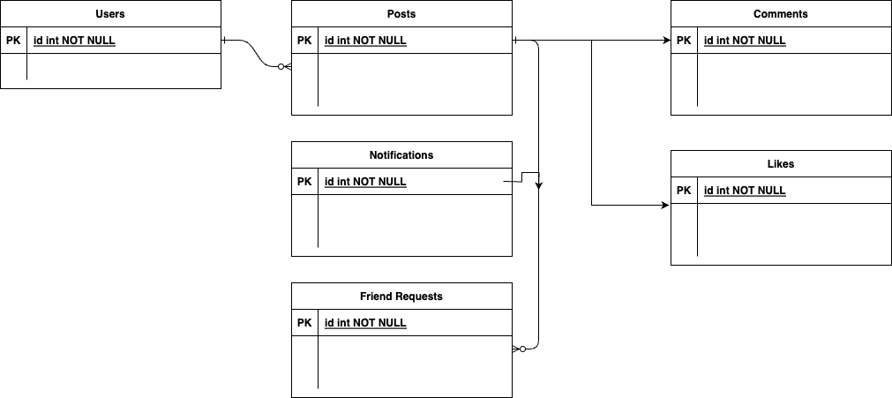

# Steps to do:

- Run `assignment4.sql` to create required tables.
- Update `config/config.php` with correct db name and password (if required)
- Open `localhost:<port>/register.php`
  - One can use below test credentials if they don't want to register a new user.
    - rohit@gmail.com, rohit
    - steve@gmail.com, steve
    - mark@gmail.com, mark1
- Screenshots under `output/screenshots` is showing more details about the functionality.

-----
-----



```
users
posts
notifications
likes
friend_requests
comments
```

- register.php
  - Main file request to login or registration.
- index.php
  - homepage after login
- post.php
  - page for adding a post logic
- profile.php
  - page for user profile details
- search.php
  - page for search field logic
- upload.php
  - uploading profile pic
- requests.php
  - Sending friend requests
- friends.php
  - Showing friends
- like.php
  - liking a post
- comment_frame.php
  - commenting on a post
- settings.php
  - updating user details

- Folder - assets -> contains CSS, images, js files
- Folder - config -> connection with MySql
- includes - reuable files
- output - application output


```
CREATE TABLE `users` (
  `id` int(11) NOT NULL,
  `first_name` varchar(25) NOT NULL,
  `last_name` varchar(25) NOT NULL,
  `username` varchar(100) NOT NULL,
  `email` varchar(100) NOT NULL,
  `password` varchar(255) NOT NULL,
  `signup_date` date NOT NULL,
  `profile_pic` varchar(255) NOT NULL,
  `num_posts` int(11) NOT NULL,
  `num_likes` int(11) NOT NULL,
  `user_closed` varchar(3) NOT NULL,
  `friend_array` text NOT NULL
) ENGINE=InnoDB DEFAULT CHARSET=latin1;
```

```
CREATE TABLE `posts` (
  `id` int(11) NOT NULL,
  `body` text NOT NULL,
  `added_by` varchar(60) NOT NULL,
  `user_to` varchar(60) NOT NULL,
  `date_added` datetime NOT NULL,
  `user_closed` varchar(3) NOT NULL,
  `deleted` varchar(3) NOT NULL,
  `likes` int(11) NOT NULL,
  `image` varchar(500) NOT NULL
) ENGINE=InnoDB DEFAULT CHARSET=latin1;
```

```
CREATE TABLE `comments` (
  `id` int(11) NOT NULL,
  `post_body` text NOT NULL,
  `posted_by` varchar(60) NOT NULL,
  `posted_to` varchar(60) NOT NULL,
  `date_added` datetime NOT NULL,
  `removed` varchar(3) NOT NULL,
  `post_id` int(11) NOT NULL
) ENGINE=InnoDB DEFAULT CHARSET=latin1;
```

```
CREATE TABLE `friend_requests` (
  `id` int(11) NOT NULL,
  `user_to` varchar(50) NOT NULL,
  `user_from` varchar(50) NOT NULL
) ENGINE=InnoDB DEFAULT CHARSET=latin1;
```

```
CREATE TABLE `likes` (
  `id` int(11) NOT NULL,
  `username` varchar(60) NOT NULL,
  `post_id` int(11) NOT NULL
) ENGINE=InnoDB DEFAULT CHARSET=latin1;
```

```
CREATE TABLE `notifications` (
  `id` int(11) NOT NULL,
  `user_to` varchar(50) NOT NULL,
  `user_from` varchar(50) NOT NULL,
  `message` text NOT NULL,
  `link` varchar(100) NOT NULL,
  `datetime` datetime NOT NULL,
  `opened` varchar(3) NOT NULL,
  `viewed` varchar(3) NOT NULL
) ENGINE=InnoDB DEFAULT CHARSET=latin1;
```

